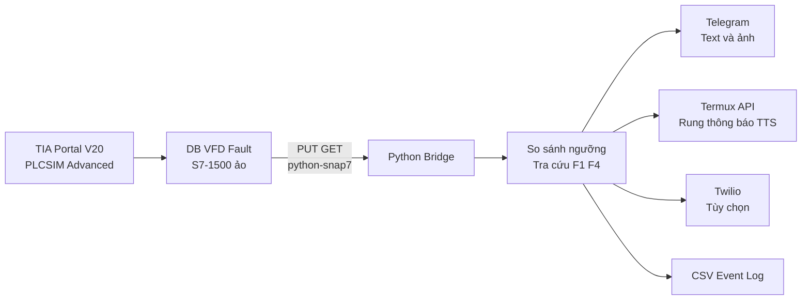

# Mô phỏng giám sát và cảnh báo lỗi VFD bằng S7-1500

Dự án Đồ án 1 mô phỏng hệ thống giám sát dòng điện và nhiệt độ của hệ truyền động dùng biến tần. PLC S7-1500 ảo tạo dữ liệu vận hành, Python Bridge đọc Data Block qua `python-snap7`, phát hiện vượt ngưỡng và gửi cảnh báo đến điện thoại.

> Phạm vi hiện tại là mô phỏng chức năng. Dự án chưa đọc dữ liệu trực tiếp từ biến tần SINAMICS V20, chưa thử trên động cơ thật và chưa xây dựng mô hình dự báo tuổi thọ còn lại.

## Chức năng hiện có

- Bật hoặc tắt hệ thống mô phỏng bằng `SystemOn`.
- Mô phỏng lỗi F1 quá dòng và F4 quá nhiệt.
- Tăng hoặc giảm dòng điện, nhiệt độ theo từng bước 500 ms.
- Đọc dữ liệu PLC S7-1500 qua PUT/GET.
- Cảnh báo khi dòng điện vượt 15 A hoặc nhiệt độ vượt 90 °C.
- Gửi Telegram dạng tin nhắn và ảnh webcam.
- Tùy chọn gọi điện qua Twilio.
- Tùy chọn rung, thông báo Android và đọc cảnh báo qua Termux:API.
- Ghi sự kiện vào `data-logs/fault_events.csv`.

## Kiến trúc



## Cấu trúc thư mục

```text
mo-phong-bao-tri-vfd-s7-1500/
├── mophongban2/          Project TIA Portal V20
├── scl/                  Data Block và Function Block SCL
├── python-bridge/        Chương trình đọc PLC và gửi cảnh báo
├── test-harness/         Các script kiểm tra từng chức năng
├── docs-thiet-ke/        Ghi chú thiết kế DB mô phỏng
├── docs/                 Báo cáo và tài liệu xin ý kiến giảng viên
├── data-logs/            Dữ liệu sinh ra khi chạy, không đưa lên Git
├── .env.example          Mẫu cấu hình không chứa bí mật
├── PROJECT_CONTEXT.md    Phạm vi và trạng thái hiện tại
└── HANDOFF_LOG.md        Nhật ký phiên bản đã chuẩn hóa
```

## Yêu cầu

- Windows có TIA Portal V20 và PLCSIM Advanced.
- Python 3.11 trở lên.
- CPU S7-1500 ảo cho phép PUT/GET.
- Data Block `DB_VFD_Fault` phải tắt `Optimized block access`.

## Cài đặt Python

```powershell
python -m venv venv
venv\Scripts\Activate.ps1
pip install -r requirements.txt
Copy-Item .env.example .env
```

Mở `.env` và điền IP PLC, số DB và các thông tin dịch vụ cần sử dụng. Không đưa `.env` lên GitHub.

## Cấu hình mặc định

| Tham số | Giá trị |
|---|---:|
| Dòng điện bình thường | 8.0 A |
| Nhiệt độ bình thường | 50.0 °C |
| Ngưỡng cảnh báo dòng điện | 15.0 A |
| Ngưỡng cảnh báo nhiệt độ | 90.0 °C |
| Chu kỳ đọc PLC | 500 ms |
| Chu kỳ nhắc lại Termux | 300 s |
| DB mặc định | DB1, phải kiểm tra lại trong TIA Portal |

## Chuẩn bị TIA Portal

1. Import `scl/DB_VFD_Fault.scl` và Generate blocks from source.
2. Tắt `Optimized block access` cho `DB_VFD_Fault`.
3. Import `scl/FB_SimulateVFDFault.scl` và gọi khối trong OB1.
4. Compile và download xuống CPU ảo.
5. Kiểm tra số DB và offset ở chế độ Extended.
6. Cập nhật `DB_NUMBER` và `PLC_IP` trong `.env`.

## Chạy kiểm tra

```powershell
python test-harness/smoke_test_connection.py
python test-harness/test_telegram_notify.py
python test-harness/test_termux_notify.py
```

Hai lệnh sau cho phép bật hệ thống và tạo lỗi mà không cần thao tác Watch Table:

```powershell
python test-harness/toggle_system_on.py on
python test-harness/inject_test_fault.py overcurrent
python test-harness/inject_test_fault.py overtemperature
```

## Chạy chương trình chính

```powershell
python python-bridge/main_bridge.py
```

Nhấn `Ctrl+C` để dừng.

## Kịch bản kiểm chứng

| Mã | Kích thích | Kết quả mong đợi |
|---|---|---|
| TC01 | `SystemOn=TRUE`, không lỗi | Dòng về 8 A, nhiệt độ về 50 °C, không cảnh báo |
| TC02 | Kích hoạt quá dòng | Dòng tăng 0.5 A mỗi 500 ms, cảnh báo khi lớn hơn 15 A |
| TC03 | Kích hoạt quá nhiệt | Nhiệt tăng 1.5 °C mỗi 500 ms, cảnh báo khi lớn hơn 90 °C |
| TC04 | Reset hoặc tắt hệ thống | Xóa lỗi, giá trị giảm về trạng thái bình thường hoặc 0 |
| TC05 | Mất kết nối PLC | Python Bridge thử kết nối lại sau 5 giây |
| TC06 | Termux TTS không phản hồi | Timeout và vòng đọc PLC tiếp tục hoạt động |

## Bảo mật và dữ liệu

- Không commit `.env`, token, mật khẩu, số điện thoại hoặc thông tin tài khoản.
- Không commit `venv/`, `__pycache__/`, file log chạy thật hoặc ảnh webcam.
- Nếu token từng được chia sẻ ra ngoài, cần thu hồi và tạo token mới.
- `.env.example` chỉ chứa tên biến và giá trị mẫu không nhạy cảm.

## Tài liệu

- `docs/XIN_Y_KIEN_GIANG_VIEN.md`: tóm tắt để giảng viên xác nhận hướng thực hiện.
- `docs/BAO_CAO_DO_AN_1.docx`: bản báo cáo hiện có.
- `PROJECT_CONTEXT.md`: trạng thái kỹ thuật hiện tại.
- `HANDOFF_LOG.md`: các mốc chính của phiên bản gửi thầy xem.

