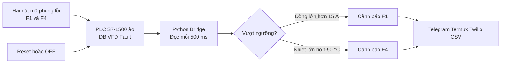

# Nội dung xin ý kiến giảng viên

## Thông tin đề tài

**Tên đang sử dụng:** Bảo trì và dự đoán trong công nghiệp

**Phiên bản kỹ thuật hiện tại:** Mô phỏng giám sát và cảnh báo lỗi biến tần bằng PLC S7-1500 ảo và Python Bridge.

**Sinh viên thực hiện:**

- Lê Ngọc Mến - CNDD2311032
- Đỗ Long Thuận - CNDD2311005

## Mục tiêu đề xuất

Nhóm xây dựng mô hình kiểm chứng chuỗi dữ liệu từ PLC đến điện thoại. PLC S7-1500 ảo tạo dòng điện và nhiệt độ mô phỏng. Python Bridge đọc dữ liệu, phát hiện vượt ngưỡng, lưu sự kiện và gửi cảnh báo.

Phiên bản hiện tại nhằm chứng minh chức năng giám sát và cảnh báo sớm. Nhóm chưa khẳng định đã dự báo chính xác hư hỏng hoặc tuổi thọ còn lại của động cơ.

## Sơ đồ chức năng

## Các feature được chia nhỏ

| Mã | Feature | Kết quả cần có |
|---|---|---|
| F01 | Bật và tắt hệ thống | Dòng, nhiệt độ tiến về trạng thái tương ứng |
| F02 | Mô phỏng quá dòng | Dòng tăng, nhiệt độ giữ bình thường |
| F03 | Mô phỏng quá nhiệt | Nhiệt tăng, dòng giữ bình thường |
| F04 | Đọc dữ liệu PLC | Python đọc đúng bit, Int và Real trong DB |
| F05 | Phát hiện vượt ngưỡng | Chỉ tạo sự kiện khi điều kiện cảnh báo xuất hiện |
| F06 | Gửi Telegram | Nhận tin nhắn và ảnh webcam |
| F07 | Cảnh báo Termux | Điện thoại rung, hiện thông báo và đọc nội dung |
| F08 | Reset và phục hồi | Xóa latch, dừng nhắc lại và gửi trạng thái phục hồi |
| F09 | Nhật ký sự kiện | CSV ghi thời gian, mã lỗi, dòng, nhiệt độ và trạng thái gửi |
| F10 | Kiểm thử và tài liệu | Có testcase, ảnh minh chứng và báo cáo khớp mã nguồn |

## Phạm vi đã hoàn thành

- Mã SCL cho Data Block và Function Block mô phỏng.
- Hai tình huống F1 quá dòng và F4 quá nhiệt.
- Python Bridge đọc DB bằng `python-snap7`.
- Telegram, webcam, Termux:API và Twilio tùy chọn.
- Test harness và báo cáo Đồ án 1.

## Phần chưa thực hiện

- Chưa kết nối SINAMICS V20, động cơ và V-Box thật.
- Chưa đọc thanh ghi Modbus thực tế.
- Chưa có dữ liệu suy giảm dài hạn.
- Chưa xây dựng mô hình học máy hoặc dự báo RUL.
- Chưa đánh giá cảnh báo giả, cảnh báo bỏ sót và độ trễ bằng bộ thử chuẩn hóa.

## Nội dung xin thầy xác nhận

1. Phạm vi Đồ án 1 chỉ mô phỏng hai lỗi F1 và F4 có phù hợp không?
2. Tên đề tài hiện tại có quá rộng so với phần đã triển khai hay cần đổi thành tên cụ thể hơn?
3. Sơ đồ chức năng và cách chia mười feature như trên đã đúng hướng chưa?
4. Phần Termux, webcam và Twilio nên giữ trong phạm vi chính hay chỉ để phần mở rộng?
5. Repo cần để công khai hay riêng tư và thầy muốn được mời bằng tài khoản GitHub nào?
6. Thầy có yêu cầu mỗi thành viên dùng branch riêng hoặc quy ước commit cụ thể không?
7. Báo cáo có cần bổ sung kiểm thử trên thiết bị thật trong Đồ án 1 không?

## Kế hoạch GitHub sau khi được xác nhận

- Tạo repo từ gói mã nguồn đã loại `.env`, `venv`, cache và log cá nhân.
- Đưa mã SCL, Python, test, tài liệu thiết kế và project TIA Portal lên repo.
- Mỗi feature hoặc lần sửa có một commit riêng, nội dung mô tả rõ ràng.
- Không tạo lịch sử commit giả cho những công việc đã làm trước khi có repo.
- Gửi link repo để giảng viên có thể xem tiến độ bất cứ lúc nào.

